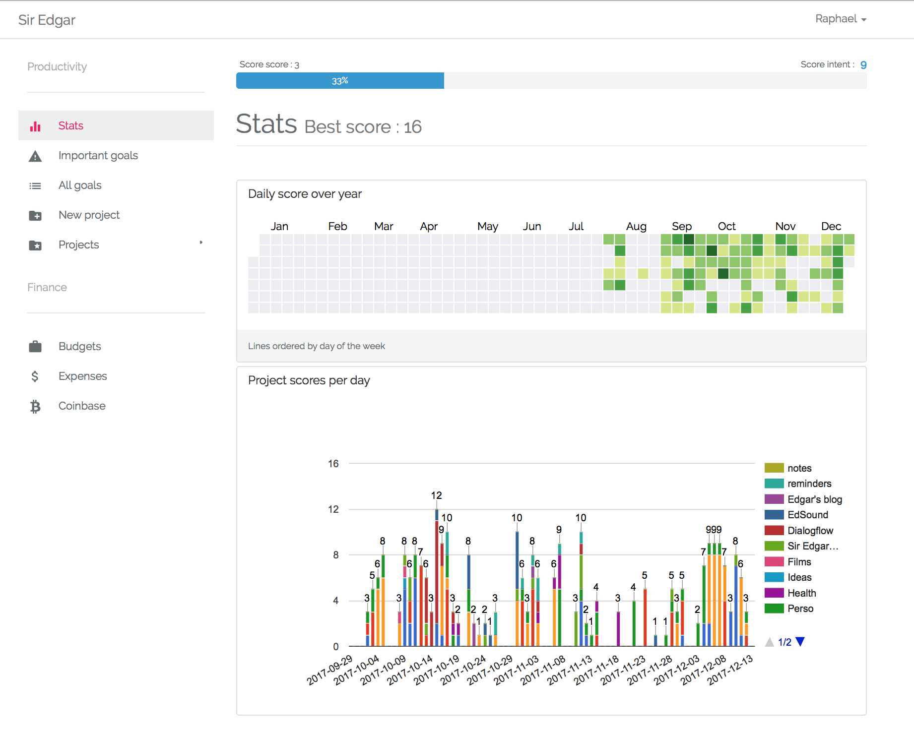
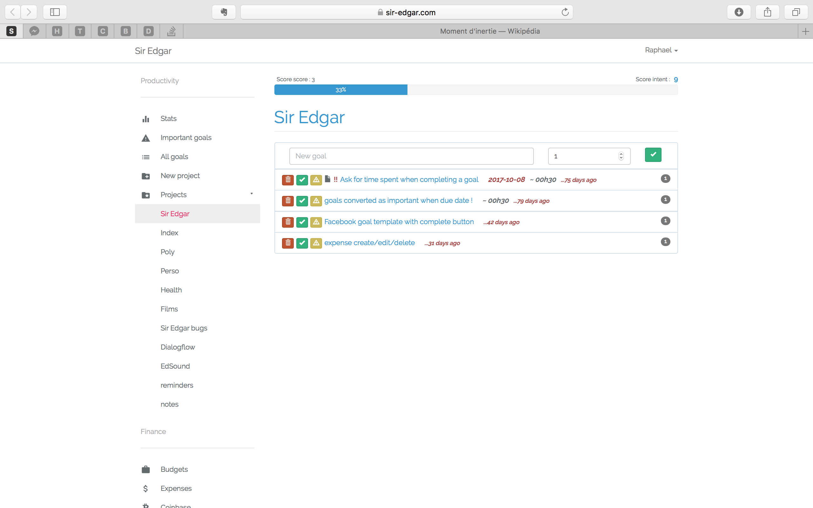
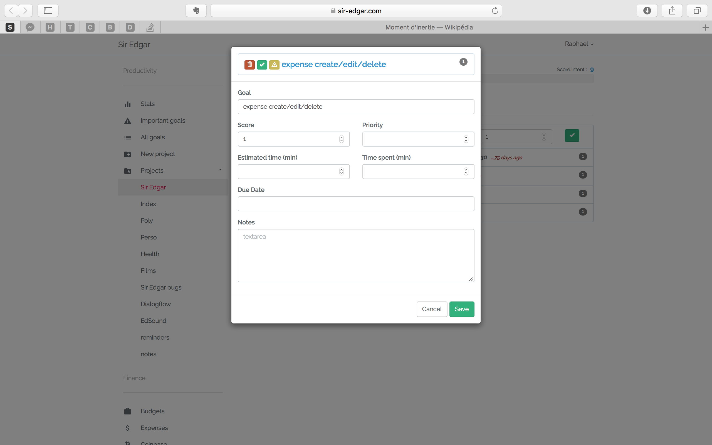

# Sir Edgar 

Sir-Edgar is a wep app to manage tasks/goals and expenses.
I develop this app during my freetime for my personnal usage.
The main idea is to set a daily productivity score to achieve and track it over time.
Each goal/task has a score value that increments your daily score when completed.

The project is not maintain anymore.

--- 
- laravel 6.x
- reactJS 15.6
- mongodb 3.6
- mysql